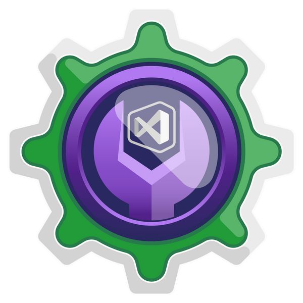
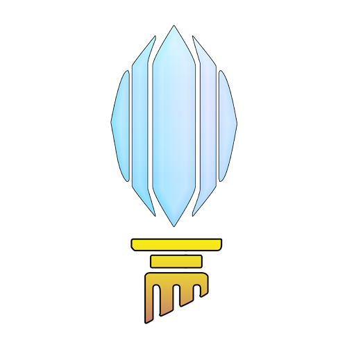
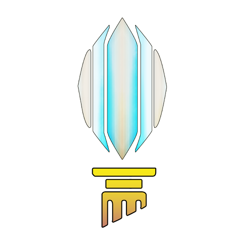
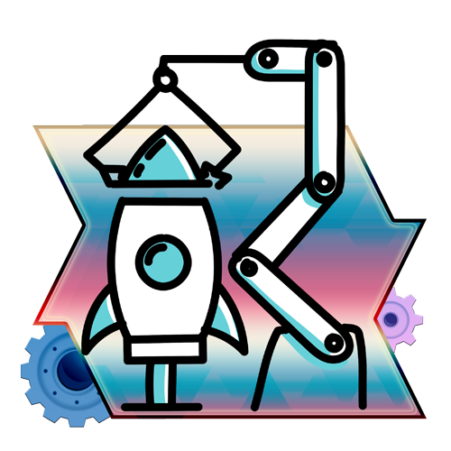
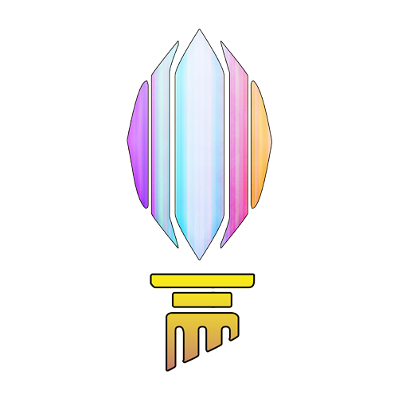
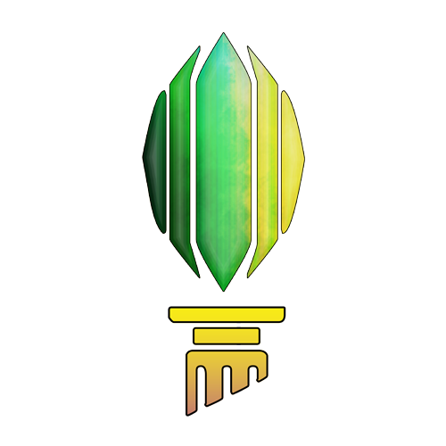
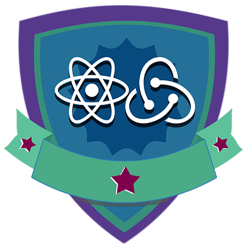
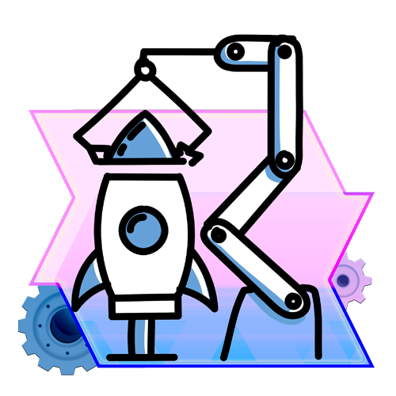

  
  <h1>Bootcamp Take Blip Fullstack Developer #2</h1> 

 

## Módulos, Mentorias e Desafios do BootCamp Take Blip

| Logo                                                                               | Módulos                                                                                        | Repositório                                      | Certificado                                           | Status |
| ---------------------------------------------------------------------------------- | ---------------------------------------------------------------------------------------------- | ------------------------------------------------ | ----------------------------------------------------- | ------ |
|                                 | Boas-vindas ao Bootcamp Take Blip Fullstack Developer #2                                       |                                                  |  | ✔️      |
|                                 | Bem-vindo à DIO                                                                                | ❌                                                |  | ✔️      |
|                                                                                    | Mentoria 01 : Como ser o próximo contratado pela Take                                          | ❌                                                | Live                                                  | ✔️      |
|                 | Lógica de Programação Essencial                                                                |  |  |        |
|                      | Introdução ao Git e ao GitHub                                                                  |                                                  |  |        |
|                                                        | Mentoria 02 : Aplicando os conceitos de GIT na Prática                                         |                                                  | Live                                                  |        |
|                  | Instalando o Visual Studio e SDK                                                               |                                                  |  |        |
|                      | Primeiros Passos com .NET                                                                      |                                                  |  |        |
|                                   | Orientação a Objetos em .NET                                                                   |                                                  |  |        |
|           | Resolvendo desafios de código em C#                                                            |                                                  |  |        |
|                  | Primeiros Desafios em C#                                                                       |                                                  |  |        |
|  | Criando um APP simples de cadastro de séries em .NET                                           |                                                  |  |        |
|                                                        | Mentoria 03 : Entendendo os principais conceitos de programação orientada a objetos na prática |                                                  | Live                                                  |        |
|             | Fundamentos da Arquitetura de Sistemas                                                         |                                                  |  |        |
|                                  | SQL SERVER - Criando suas primeiras consultas                                                  |                                                  |  |        |
|          | Desenvolvimento de Aplicações com .NET                                                         |                                                  |  |        |
|                       | Desafios Básicos C#                                                                            |                                                  |  |        |
|                                                        | Mentoria 04 : testes Unitários na prática com .NET                                             |                                                  | Live                                                  |        |
|                         | Configuração da arquitetura back-end com .NET Core                                             |                                                  |  |        |
|                            | Criando um catálogo de jogos usando boas práticas de arquitetura com .NET                      |                                                  |  |        |
|               | Desafios Intermediários C#                                                                     |                                                  |  |        |
|                                                        | Mentoria 05 : WebSocket - Conexões persistentes                                                |                                                  | Live                                                  |        |
|                                    | Introdução a criação de websites com HTML5 e CSS3                                              |                                                  |  |        |
|                              | JavaScript ES6 Essencial                                                                       |                                                  |  |        |
|                | Primeiros Desafios JavaScript                                                                  |                                                  |  |        |
|                                                        | Mentoria 06 : TypeScript - início prático                                                      |                                                  | Live                                                  |        |
|                          | Introdução ao ReactJS                                                                          |                                                  |  |        |
|                  | Trabalhando com componentes em React                                                           |                                                  |  |        |
|     | Desenvolvimento de aplicações para internet com ReactJS                                        |                                                  |  |        |
|         | Práticas avançadas em projetos ReactJS                                                         |                                                  |  |        |
|                    | Introdução aos React Hooks                                                                     |                                                  |  |        |
|                          | Criando um front-end totalmente componentizado na prática com ReactJS                          |                                                  |  |        |
|                                                        | Mentoria 07 : Desenvolvendo microfrontends utilizando React                                    |                                                  | Live                                                  |        |